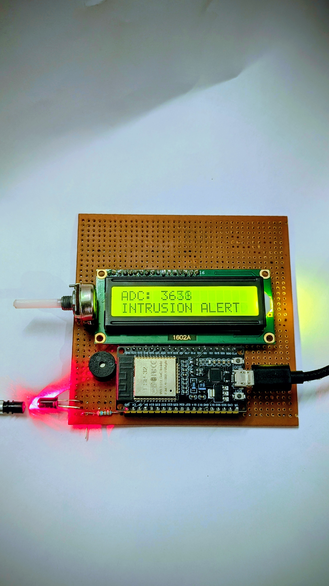
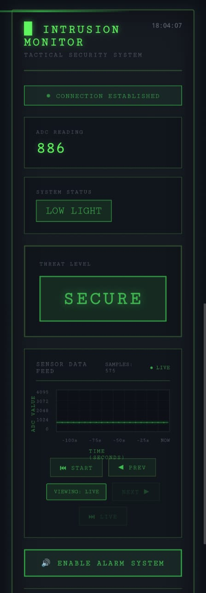
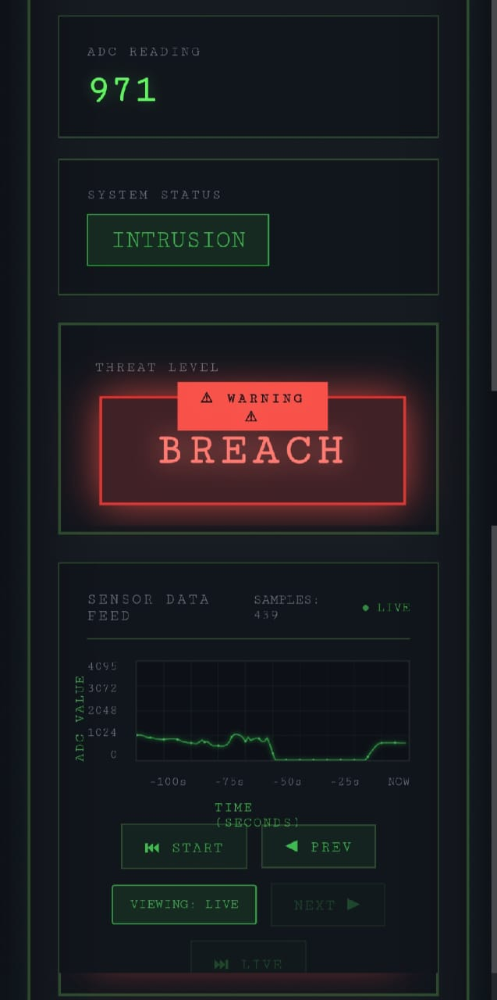
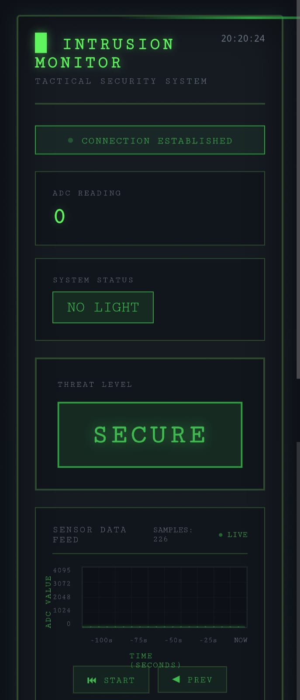

# Intrusion Detection Using Fiber Optics

An ESP32-based intrusion detection system that uses a fiber-optic / photodiode sensor to detect vibration patterns along the fiber line — distinguishing between **walking**, **digging**, and **intrusion-level disturbances**. The system displays live status on an LCD, sounds a buzzer, and streams real-time sensor data to a web dashboard over WiFi.

## How It Works

A light sensor connected to the ESP32's ADC pin continuously monitors light intensity passing through the fiber-optic line. Sudden or sustained changes in the ADC reading indicate physical disturbance near the fiber:

- **Small, sustained vibration** → classified as **Walking**
- **Large, sudden spike** → classified as **Digging**
- **Strong, rapid, sustained vibration** → classified as **Intrusion** (triggers alarm)

The system also detects light-level faults (no light / low light / oversaturation) to flag sensor or cable issues separately from real intrusions.

## Circuit Diagram



## Features

- Real-time vibration/light analysis using a rolling time-window algorithm
- On-device LCD status display (16x2)
- Buzzer alert for digging and intrusion events
- WiFi-connected web dashboard with:
  - Live ADC graph (scrollable history, not just live feed)
  - Threat level indicator (Secure / Breach)
  - Audible browser-side alarm (siren) that can be toggled on/off
- WebSocket-based live data push (no page refresh needed)

## Web Dashboard

<table>
  <tr>
    <td></td>
    <td></td>
    <td></td>
  </tr>
</table>

## Hardware Used

- ESP32 Dev Board
- Photodiode / light sensor on fiber-optic line (connected to ADC pin 34)
- 16x2 LCD (parallel interface)
- Buzzer (digital output)

## Software / Libraries

- `WiFi.h`
- `WebServer.h`
- `WebSocketsServer.h`
- `LiquidCrystal.h`

Install these via the Arduino Library Manager before compiling.

## Setup

1. Open `IntrusionDetector_ESP32.ino` in the Arduino IDE.
2. Replace the placeholder WiFi credentials with your own:
   ```cpp
   const char* ssid = "YOUR_WIFI_NAME";
   const char* password = "YOUR_WIFI_PASSWORD";
   ```
3. Connect your hardware as per the pin definitions in the code (LCD pins, ADC pin, buzzer pin).
4. Upload the sketch to your ESP32.
5. Open the Serial Monitor to find the ESP32's IP address once it connects to WiFi.
6. Visit that IP address in a browser to view the live dashboard.

## Tuning Detection Sensitivity

These constants in the code control how sensitive the system is — adjust based on your fiber setup and sensor placement:

| Constant | Purpose |
|---|---|
| `MIN_DELTA_ADC` | Minimum ADC change per loop to count as vibration |
| `TIME_WINDOW_MS` | Time window for summing vibration before evaluating |
| `INTRUSION_SUM_THRESHOLD` | Vibration sum needed to trigger an intrusion alert |
| `WALKING_SUM_THRESHOLD` | Vibration sum needed to classify as walking |
| `DIGGING_SPIKE_THRESHOLD` | Single-reading spike needed to classify as digging |

## Status

Actively in development. Planned additions: Python backend integration, data logging, and improved fiber-signal calibration.
